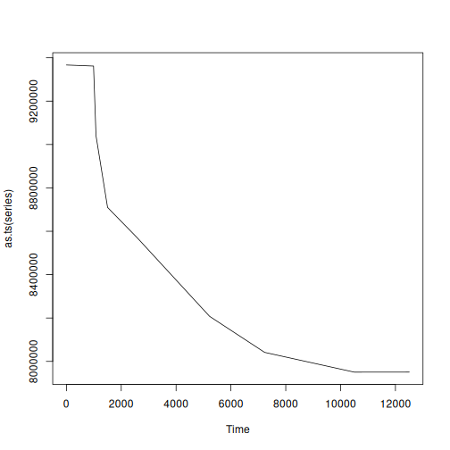
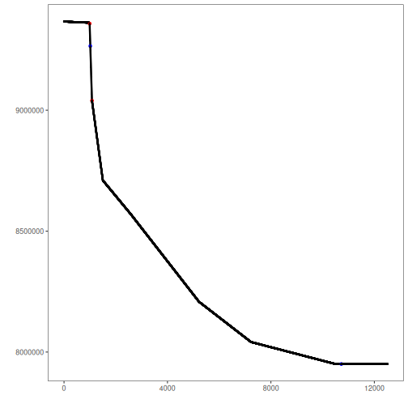

The first realistic and public dataset with rare undesirable real events in oil wells.

* Multivariate series with labeled change points
* Recommended use: multivariate or univariate CPD detection

Source: https://archive.ics.uci.edu/ml/datasets/3W+dataset


## Load series

``` r
library(dalevents)
library(daltoolbox)
library(harbinger)
```

Selecting a well as example


``` r
## Load series ----------------------
data(oil_3w_Type_1)
```


``` r
#Selecting
data <- oil_3w_Type_1[[1]]
```


## Univariate series selection
Select the desired variable directly from preprocessed data.


``` r
series <- data$p_mon_ckp
plot(as.ts(series))
```



## Event detection experiment


Detection steps

``` r
#Establishing arima method
model <- hanr_arima()
```


``` r
#Fitting the model
model <- fit(model, series)
```


``` r
#Making detections
detection <- detect(model, series)
```


## Results analysis


``` r
#Filtering detected events
print(detection |> dplyr::filter(event==TRUE))
```

```
##    idx event    type
## 1  991  TRUE anomaly
## 2 1081  TRUE anomaly
```

Visual analysis

``` r
#Ploting the results
grf <- har_plot(model, series, detection, data$event)
plot(grf)
```



Evaluate metrics

``` r
#Evaluating the detection metrics
ev <- evaluate(model, detection$event, data$event)
print(ev$confMatrix)
```

```
##           event      
## detection TRUE  FALSE
## TRUE      0     2    
## FALSE     2     12501
```


### SoftEd Evaluation
To analyze the results considering temporal tolerance, softED smoothed metrics can be used, as performed below.


``` r
ev_soft <- evaluate(har_eval_soft(sw=90), detection$event, data$event)
print(ev_soft$confMatrix)
```

```
##           event         
## detection TRUE  FALSE   
## TRUE      0.71  1.29    
## FALSE     1.29  12501.71
```


``` r
ev_soft$accuracy
```

```
## [1] 0.9997939
```

``` r
ev_soft$F1
```

```
## [1] 0.3555556
```
