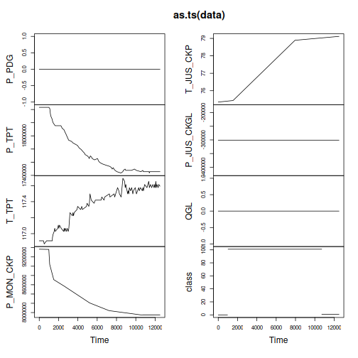
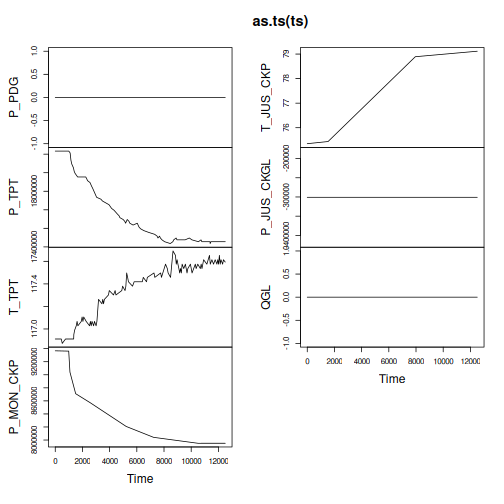
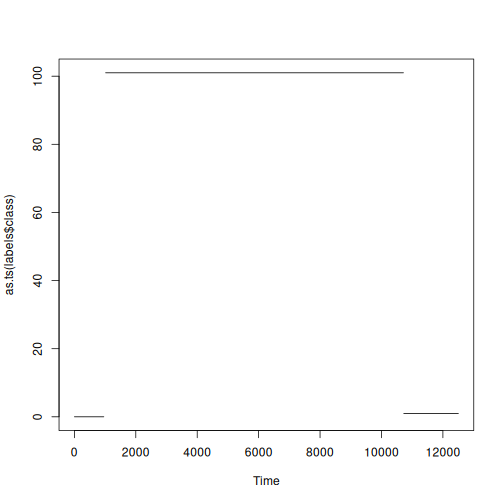
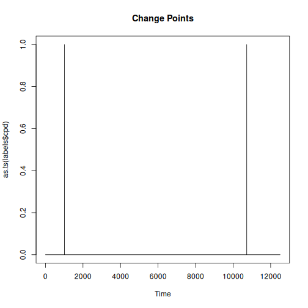
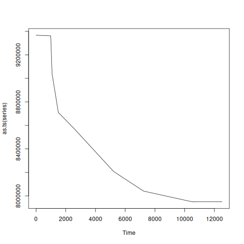
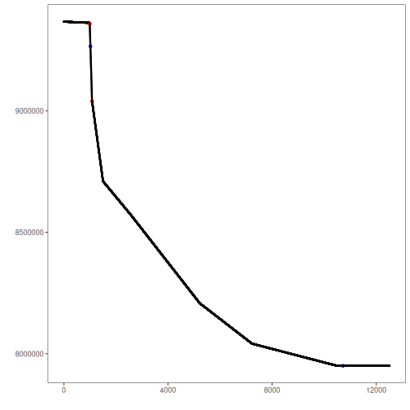

The first realistic and public dataset with rare undesirable real events in oil wells.

* Multivariate series with labeled change points
* Recommended use: multivariate or univariate CPD detection

Source: https://archive.ics.uci.edu/ml/datasets/3W+dataset


## Load series

``` r
library(dalevents)
library(daltoolbox)
library(harbinger)


## Load series ----------------------
data(oil_3w_Type_1)
```

Selecting a well as example


``` r
#Selecting
data <- oil_3w_Type_1$Type_1$`WELL-00001_20140124213136`
summary(data)
```

```
##      P_PDG       P_TPT              T_TPT         P_MON_CKP         T_JUS_CKP       P_JUS_CKGL     
##  Min.   :0   Min.   :17435930   Min.   :116.9   Min.   :7950450   Min.   :75.35   Min.   :-300918  
##  1st Qu.:0   1st Qu.:17472050   1st Qu.:117.2   1st Qu.:7981696   1st Qu.:76.30   1st Qu.:-300918  
##  Median :0   Median :17598880   Median :117.4   Median :8122462   Median :77.98   Median :-300918  
##  Mean   :0   Mean   :17739948   Mean   :117.4   Mean   :8294544   Mean   :77.62   Mean   :-300918  
##  3rd Qu.:0   3rd Qu.:17929330   3rd Qu.:117.5   3rd Qu.:8495280   3rd Qu.:78.96   3rd Qu.:-300918  
##  Max.   :0   Max.   :18433410   Max.   :117.7   Max.   :9366608   Max.   :79.12   Max.   :-300918  
##                                                                                                    
##  T_JUS_CKGL          QGL        class      
##  Mode:logical   Min.   :0   Min.   :  0.0  
##  NA's:12505     1st Qu.:0   1st Qu.:101.0  
##                 Median :0   Median :101.0  
##                 Mean   :0   Mean   : 78.9  
##                 3rd Qu.:0   3rd Qu.:101.0  
##                 Max.   :0   Max.   :101.0  
##                             NA's   :65
```

## Preprocessing

* Remove NA values


``` r
#Removing empty variables
data$T_JUS_CKGL <- NULL

plot(as.ts(data))
```



* Normalize data


``` r
#data <- na.omit(data)
ts <- data[,1:7]

preproc <- ts_norm_gminmax()
```

```
## Error in ts_norm_gminmax(): could not find function "ts_norm_gminmax"
```

``` r
preproc <- fit(preproc, ts)
```

```
## Error: object 'preproc' not found
```

``` r
ts <- transform(preproc, ts)
```

```
## Error: object 'preproc' not found
```

``` r
head(ts)
```

```
## # A tibble: 6 × 7
##   P_PDG    P_TPT T_TPT P_MON_CKP T_JUS_CKP P_JUS_CKGL   QGL
##   <dbl>    <dbl> <dbl>     <dbl>     <dbl>      <dbl> <dbl>
## 1     0 18433410  117.   9366608      75.3   -300918.     0
## 2     0 18433410  117.   9366602      75.3   -300918.     0
## 3     0 18433410  117.   9366598      75.3   -300918.     0
## 4     0 18433410  117.   9366592      75.3   -300918.     0
## 5     0 18433410  117.   9366588      75.3   -300918.     0
## 6     0 18433410  117.   9366583      75.3   -300918.     0
```

``` r
plot(as.ts(ts))
```



## Labels adjust

It is essential to understand the dataset, including data types and intended use, to ensure accurate interpretation of labels. In the 3W dataset, the classes represent transitional stages in behavior observed during oil well drilling monitoring. For event detection purposes, the labels are being adjusted to treat each stage transition as a distinct event.


``` r
labels <- as.data.frame(data$class)
names(labels) <- "class"
plot(as.ts(labels$class))
```



``` r
labels$cpd <- 0
head(labels)
```

```
##   class cpd
## 1     0   0
## 2     0   0
## 3     0   0
## 4     0   0
## 5     0   0
## 6     0   0
```

``` r
#Initial CP
cp = FALSE
for (i in 1:nrow(labels)){
  if (cp == FALSE){
    if(!is.na(labels$class[i]) && labels$class[i] != 0){
      print("Ponto de mudança rotulado em:")
      print(i)
      labels$cpd[i] <- 1
      cp = i
    }
  }
}
```

```
## [1] "Ponto de mudança rotulado em:"
## [1] 1017
```

``` r
#Final CP
i = cp+1
cp = FALSE
print(i)
```

```
## [1] 1018
```

``` r
for (i in 1018:nrow(labels)){
  if (cp == FALSE){
    if(!is.na(labels$class[i]) && labels$class[i] != 101){
      print("Ponto de mudança rotulado em:")
      print(i)
      labels$cpd[i] <- 1
      cp = i
    }
  }
}
```

```
## [1] "Ponto de mudança rotulado em:"
## [1] 10725
```

``` r
#Count of CP
sum(labels$cpd)
```

```
## [1] 2
```

``` r
plot(as.ts(labels$cpd),
     main = "Change Points")
```




## Univariate series selection
Select the desired variable directly from preprocessed data.


``` r
series <- ts$P_MON_CKP
plot(as.ts(series))
```



## Event detection experiment

Creating a data frame to organize experiment results.


``` r
#Experiments results organization
experiment <- data.frame(method="hanr_arima",
                         dataset="3W",
                         series="Type_1_WELL_00001_20140124213136_P_MON_CKP",
                         elapsed_time_fit=0,
                         elapsed_time_detection=0,
                         accuracy=0,
                         precision=0,
                         recall=0,
                         F1=0)

head(experiment)
```

```
##       method dataset                                     series elapsed_time_fit elapsed_time_detection
## 1 hanr_arima      3W Type_1_WELL_00001_20140124213136_P_MON_CKP                0                      0
##   accuracy precision recall F1
## 1        0         0      0  0
```
Detection steps

``` r
#Establishing arima method
model <- hanr_arima()
```


``` r
#Fitting the model
s <- Sys.time()
model <- fit(model, series)
t_fit <- Sys.time()-s
```


``` r
#Making detections
s <- Sys.time()
detection <- detect(model, series)
t_det <- Sys.time()-s
```


## Results analysis


``` r
#Filtering detected events
print(detection |> dplyr::filter(event==TRUE))
```

```
##    idx event    type
## 1  991  TRUE anomaly
## 2 1081  TRUE anomaly
```

Visual analysis

``` r
#Ploting the results
grf <- har_plot(model, series, detection, labels$cpd)
plot(grf)
```



Evaluate metrics

``` r
#Evaluating the detection metrics
ev <- evaluate(model, detection$event, labels$cpd)
print(ev$confMatrix)
```

```
##           event      
## detection TRUE  FALSE
## TRUE      0     2    
## FALSE     2     12501
```

Recording experiment results

``` r
#Experiment update
#Time
experiment$elapsed_time_fit[1] <- as.numeric(t_fit)*60
experiment$elapsed_time_detection[1] <- as.numeric(t_det)*60

#Metrics
experiment$accuracy[1] <- ev$accuracy
experiment$precision[1] <- ev$precision
experiment$recall[1] <- ev$recall
experiment$F1[1] <- ev$F1

print(experiment)
```

```
##       method dataset                                     series elapsed_time_fit elapsed_time_detection
## 1 hanr_arima      3W Type_1_WELL_00001_20140124213136_P_MON_CKP          3.84058              0.2335167
##    accuracy precision recall  F1
## 1 0.9996801         0      0 NaN
```

### SoftEd Evaluation
To analyze the results considering temporal tolerance, softED smoothed metrics can be used, as performed below.


``` r
ev_soft <- evaluate(har_eval_soft(sw=90), detection$event, as.logical(labels$cpd))
print(ev_soft$confMatrix)
```

```
##           event         
## detection TRUE  FALSE   
## TRUE      0.71  1.29    
## FALSE     1.29  12501.71
```


``` r
ev_soft$accuracy
```

```
## [1] 0.9997939
```

``` r
ev_soft$F1
```

```
## [1] 0.3555556
```

### Add new series to experiment 
Repeat detection steps

* Add new rows to the `experiment` data frame
* Run detection steps (create model, fit and detect) for the new series
* Update `experiment` with the new series result
  * Repeated steps for didactic purposes
  * WARNING: In real experimental situations, variable selection and repetition of detection steps should be encapsulated in a loop or function

### Experiment record
The retain experiments data record results

* Save detection results: Save `detection` object after detection of each series
* Save experiment: Save `experiment` object after finishing the complete experiment
