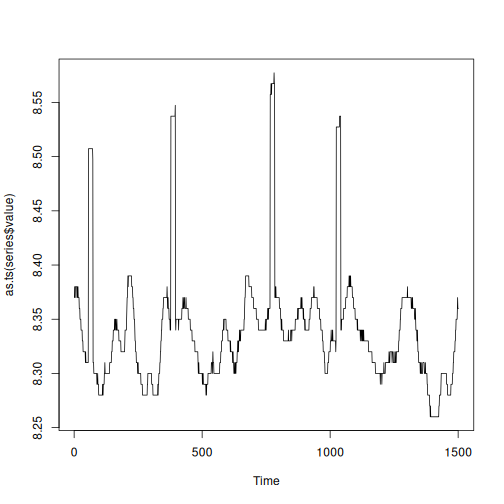

Data collection for water quality monitoring

* Multivariate series with labeled anomalies.
* Recommended use: multivariate or univariate event detection

Source: https://www.spotseven.de/gecco/gecco-challenge


## Load series

``` r
library(dalevents)
library(daltoolbox)
library(harbinger)
```

``` r
## Load series ----------------------
data(gecco)
#Plot multivariate series
plot(as.ts(gecco$multi[,2:10]))
```


Gecco recommended sample: One day with anomalies


``` r
## Univariate series selection ----------------------
series <- gecco$ph

#Gecco recommended sample: One day with anomalies
series <- series[16500:18000,]
plot(as.ts(series$value))
```




## Event detection experiment

Detection steps

``` r
#Establishing arima method
model <- hanr_arima()
```


``` r
#Fitting the model
model <- fit(model, series$value)
```


``` r
#Making detections
detection <- detect(model, series$value)
```


## Results analysis


``` r
#Filtering detected events
print(detection |> dplyr::filter(event==TRUE))
```

```
##    idx event    type
## 1   56  TRUE anomaly
## 2   74  TRUE anomaly
## 3  378  TRUE anomaly
## 4  396  TRUE anomaly
## 5  766  TRUE anomaly
## 6  784  TRUE anomaly
## 7 1024  TRUE anomaly
## 8 1042  TRUE anomaly
```

Visual analysis

``` r
#Ploting the results
grf <- har_plot(model, series$value, detection, series$event)
plot(grf)
```


Evaluate metrics

``` r
#Evaluating the detection metrics
ev <- evaluate(model, detection$event, series$event)
print(ev$confMatrix)
```

```
##           event      
## detection TRUE  FALSE
## TRUE      4     4    
## FALSE     68    1425
```
