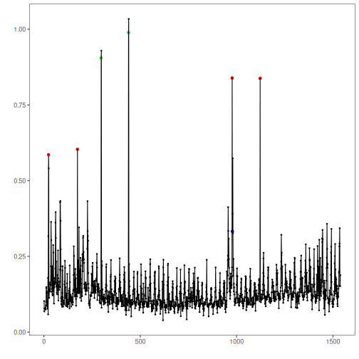

NAB is a novel benchmark for evaluating algorithms for anomaly detection in streaming, real-time applications.

* Univariate series with labeled anomalies
* Recommended use: univariate event detection

Source: https://www.numenta.com/

## Load series

``` r
library(dalevents)
library(daltoolbox)
library(harbinger)


## Load series ----------------------
data(numenta_realAdExchange)
```


Univerariate use - Example 1:

``` r
#Univerariate use
data <- numenta_realAdExchange$realAdExchange$`exchange-3_cpc_resul`
plot(as.ts(data))
```


## Event detection experiment

Creating a data frame to organize experiment results.


``` r
#Experiments results organization
experiment <- data.frame(method="hanr_arima",
                         dataset="Numenta",
                         series="realAdExchange_exchange-3_cpc_resul",
                         elapsed_time_fit=0,
                         elapsed_time_detection=0,
                         accuracy=0,
                         precision=0,
                         recall=0,
                         F1=0)

head(experiment)
```

```
##       method dataset                              series elapsed_time_fit elapsed_time_detection accuracy
## 1 hanr_arima Numenta realAdExchange_exchange-3_cpc_resul                0                      0        0
##   precision recall F1
## 1         0      0  0
```

Detection steps

``` r
#Establishing arima method
model <- hanr_arima()
```


``` r
#Fitting the model
s <- Sys.time()
model <- fit(model, data$value)
t_fit <- Sys.time()-s
```


``` r
#Making detections
s <- Sys.time()
detection <- detect(model, data$value)
t_det <- Sys.time()-s
```


## Results analysis


``` r
#Filtering detected events
print(detection |> dplyr::filter(event==TRUE))
```

```
##    idx event    type
## 1   24  TRUE anomaly
## 2  174  TRUE anomaly
## 3  297  TRUE anomaly
## 4  439  TRUE anomaly
## 5  977  TRUE anomaly
## 6 1122  TRUE anomaly
```

Visual analysis

``` r
#Ploting the results
grf <- har_plot(model, data$value, detection, data$event)
plot(grf)
```



Evaluate metrics

``` r
#Evaluating the detection metrics
ev <- evaluate(model, detection$event, data$event)
print(ev$confMatrix)
```

```
##           event      
## detection TRUE  FALSE
## TRUE      2     4    
## FALSE     1     1531
```

Recording experiment results

``` r
# Experiment update ----------------------
#Time
#Experiment update
experiment$elapsed_time_fit[1] <- as.numeric(t_fit)*60
experiment$elapsed_time_detection[1] <- as.numeric(t_det)*60
#Metrics
experiment$accuracy[1] <- ev$accuracy
experiment$precision[1] <- ev$precision
experiment$recall[1] <- ev$recall
experiment$F1[1] <- ev$F1

print(experiment)
```

```
##       method dataset                              series elapsed_time_fit elapsed_time_detection accuracy
## 1 hanr_arima Numenta realAdExchange_exchange-3_cpc_resul         24.94742               2.244101 0.996749
##   precision    recall        F1
## 1 0.3333333 0.6666667 0.4444444
```

### Add new series to experiment 
Repeat detection steps

* Add new rows to the `experiment` data frame
* Run detection steps (create model, fit and detect) for the new series
* Update `experiment` with the new series result
  * Repeated steps for didactic purposes
  * WARNING: In real experimental situations, variable selection and repetition of detection steps should be encapsulated in a loop or function

### Experiment record
The retain experiments data record results

* Save detection results: Save `detection` object after detection of each series
* Save experiment: Save `experiment` object after finishing the complete experiment
