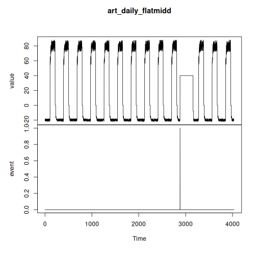
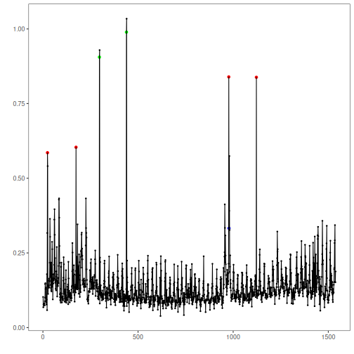

NAB is a novel benchmark for evaluating algorithms for anomaly detection in streaming, real-time applications.

* Univariate series with labeled anomalies
* Recommended use: univariate event detection

Source: https://www.numenta.com/

## Load series

``` r
library(dalevents)
library(daltoolbox)
library(harbinger)


## Load series ----------------------
data(numenta_realAdExchange)
```


Univerariate use - Example 1:

``` r
#Univerariate use
data <- numenta_realAdExchange$realAdExchange$`exchange-3_cpc_resul`
plot(as.ts(data))
```



## Event detection experiment


Detection steps

``` r
#Establishing arima method
model <- hanr_arima()
```


``` r
#Fitting the model
s <- Sys.time()
model <- fit(model, data$value)
t_fit <- Sys.time()-s
```


``` r
#Making detections
s <- Sys.time()
detection <- detect(model, data$value)
t_det <- Sys.time()-s
```


## Results analysis


``` r
#Filtering detected events
print(detection |> dplyr::filter(event==TRUE))
```

```
##    idx event    type
## 1   24  TRUE anomaly
## 2  174  TRUE anomaly
## 3  297  TRUE anomaly
## 4  439  TRUE anomaly
## 5  977  TRUE anomaly
## 6 1122  TRUE anomaly
```

Visual analysis

``` r
#Ploting the results
grf <- har_plot(model, data$value, detection, data$event)
plot(grf)
```



Evaluate metrics

``` r
#Evaluating the detection metrics
ev <- evaluate(model, detection$event, data$event)
print(ev$confMatrix)
```

```
##           event      
## detection TRUE  FALSE
## TRUE      2     4    
## FALSE     1     1531
```

