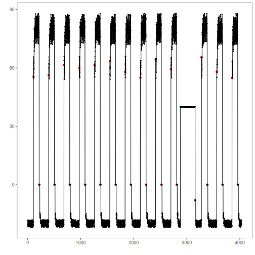

NAB is a novel benchmark for evaluating algorithms for anomaly detection in streaming, real-time applications.

* Univariate series with labeled anomalies
* Recommended use: univariate event detection

Source: https://www.numenta.com/

## Load series

``` r
library(dalevents)
library(daltoolbox)
library(harbinger)
```


Univerariate use - Example 1:

``` r
## Load series ----------------------
data(nab_artificialWithAnomaly)

#Univerariate use
data <- nab_artificialWithAnomaly[[1]]

plot(as.ts(data[,2:3]),
     main=names(nab_artificialWithAnomaly[1]))
```


## Event detection experiment


Detection steps

``` r
#Establishing arima method
model <- hanr_arima()
```


``` r
#Fitting the model
model <- fit(model, data$value)
```


``` r
#Making detections
detection <- detect(model, data$value)
```


## Results analysis


``` r
#Filtering detected events
print(detection |> dplyr::filter(event==TRUE))
```

```
##     idx event    type
## 1   109  TRUE anomaly
## 2   217  TRUE anomaly
## 3   397  TRUE anomaly
## 4   505  TRUE anomaly
## 5   685  TRUE anomaly
## 6   793  TRUE anomaly
## 7   973  TRUE anomaly
## 8  1081  TRUE anomaly
## 9  1261  TRUE anomaly
## 10 1369  TRUE anomaly
## 11 1549  TRUE anomaly
## 12 1657  TRUE anomaly
## 13 1837  TRUE anomaly
## 14 1945  TRUE anomaly
## 15 2125  TRUE anomaly
## 16 2233  TRUE anomaly
## 17 2413  TRUE anomaly
## 18 2521  TRUE anomaly
## 19 2701  TRUE anomaly
## 20 2809  TRUE anomaly
## 21 2881  TRUE anomaly
## 22 3157  TRUE anomaly
## 23 3277  TRUE anomaly
## 24 3385  TRUE anomaly
## 25 3565  TRUE anomaly
## 26 3673  TRUE anomaly
## 27 3853  TRUE anomaly
## 28 3961  TRUE anomaly
```

Visual analysis

``` r
#Ploting the results
grf <- har_plot(model, data$value, detection, data$event)
plot(grf)
```



Evaluate metrics

``` r
#Evaluating the detection metrics
ev <- evaluate(model, detection$event, data$event)
print(ev$confMatrix)
```

```
##           event      
## detection TRUE  FALSE
## TRUE      1     27   
## FALSE     0     4004
```
