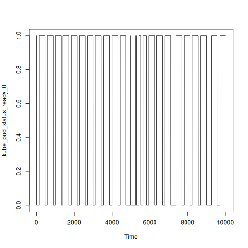
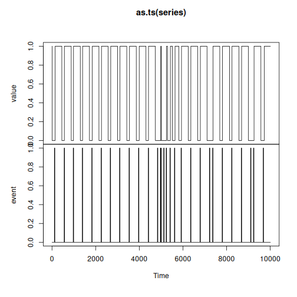
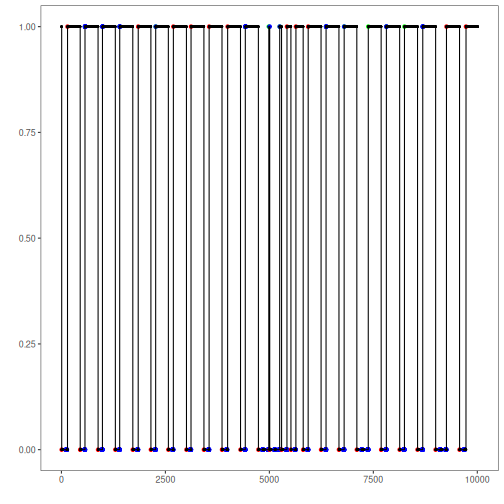

Cloud-native memory anomalies

* Multivariate series with labeled anomalies
* Recommended use: multivariate or univariate event detection
* WARNING: Example under construction - This dataset is under our analysis for better organization and suggested use.

Source: https://dl.acm.org/doi/10.1145/3416505.3423560


## Load series

``` r
library(dalevents)
library(daltoolbox)
library(harbinger)


## Load series ----------------------
data(rare)
```


## Univariate series selection
Select the desired variable.


``` r
series <- rare[2]
plot(as.ts(series))
```



## Labels

``` r
series$event <- rare$event
names(series) <- c("value", "event")


plot(as.ts(series))
```




## Event detection experiment

Creating a data frame to organize experiment results.


``` r
#Experiments results organization
experiment <- data.frame(method="hanr_arima",
                         dataset="RARE",
                         series="kube_pod_status_ready_0",
                         elapsed_time_fit=0,
                         elapsed_time_detection=0,
                         accuracy=0,
                         precision=0,
                         recall=0,
                         F1=0)

head(experiment)
```

```
##       method dataset                  series elapsed_time_fit elapsed_time_detection accuracy
## 1 hanr_arima    RARE kube_pod_status_ready_0                0                      0        0
##   precision recall F1
## 1         0      0  0
```

Detection steps

``` r
#Establishing arima method
model <- hanr_arima()
```


``` r
#Fitting the model
s <- Sys.time()
model <- fit(model, series$value)
t_fit <- Sys.time()-s
```


``` r
#Making detections
s <- Sys.time()
detection <- detect(model, series$value)
t_det <- Sys.time()-s
```


## Results analysis


``` r
#Filtering detected events
print(detection |> dplyr::filter(event==TRUE))
```

```
##     idx event    type
## 1     7  TRUE anomaly
## 2   147  TRUE anomaly
## 3   452  TRUE anomaly
## 4   567  TRUE anomaly
## 5   882  TRUE anomaly
## 6   987  TRUE anomaly
## 7  1297  TRUE anomaly
## 8  1402  TRUE anomaly
## 9  1717  TRUE anomaly
## 10 1847  TRUE anomaly
## 11 2152  TRUE anomaly
## 12 2267  TRUE anomaly
## 13 2572  TRUE anomaly
## 14 2692  TRUE anomaly
## 15 3007  TRUE anomaly
## 16 3117  TRUE anomaly
## 17 3427  TRUE anomaly
## 18 3552  TRUE anomaly
## 19 3862  TRUE anomaly
## 20 3997  TRUE anomaly
## 21 4307  TRUE anomaly
## 22 4422  TRUE anomaly
## 23 4737  TRUE anomaly
## 24 4987  TRUE anomaly
## 25 5009  TRUE anomaly
## 26 5249  TRUE anomaly
## 27 5294  TRUE anomaly
## 28 5424  TRUE anomaly
## 29 5519  TRUE anomaly
## 30 5639  TRUE anomaly
## 31 5814  TRUE anomaly
## 32 5934  TRUE anomaly
## 33 6244  TRUE anomaly
## 34 6364  TRUE anomaly
## 35 6674  TRUE anomaly
## 36 6799  TRUE anomaly
## 37 7104  TRUE anomaly
## 38 7379  TRUE anomaly
## 39 7689  TRUE anomaly
## 40 7814  TRUE anomaly
## 41 8134  TRUE anomaly
## 42 8249  TRUE anomaly
## 43 8564  TRUE anomaly
## 44 8689  TRUE anomaly
## 45 8999  TRUE anomaly
## 46 9259  TRUE anomaly
## 47 9574  TRUE anomaly
## 48 9729  TRUE anomaly
```

Visual analysis

``` r
#Ploting the results
grf <- har_plot(model, series$value, detection, series$event)
plot(grf)
```



Evaluate metrics

``` r
#Evaluating the detection metrics
ev <- evaluate(model, detection$event, series$event)
print(ev$confMatrix)
```

```
##           event      
## detection TRUE  FALSE
## TRUE      13    35   
## FALSE     548   9414
```

Recording experiment results

``` r
#Experiment update
#Time
experiment$elapsed_time_fit[1] <- as.numeric(t_fit)*60
experiment$elapsed_time_detection[1] <- as.numeric(t_det)*60

#Metrics
experiment$accuracy[1] <- ev$accuracy
experiment$precision[1] <- ev$precision
experiment$recall[1] <- ev$recall
experiment$F1[1] <- ev$F1

print(experiment)
```

```
##       method dataset                  series elapsed_time_fit elapsed_time_detection  accuracy
## 1 hanr_arima    RARE kube_pod_status_ready_0         38.41072              0.8983326 0.9417582
##   precision     recall         F1
## 1 0.2708333 0.02317291 0.04269294
```


### SoftEd Evaluation
To analyze the results considering temporal tolerance, softED smoothed metrics can be used, as performed below.


``` r
ev_soft <- evaluate(har_eval_soft(sw=90), detection$event, as.logical(series$event))
print(ev_soft$confMatrix)
```

```
##           event         
## detection TRUE   FALSE  
## TRUE      24.38  23.62  
## FALSE     536.62 9425.38
```


``` r
ev_soft$accuracy
```

```
## [1] 0.9440315
```

``` r
ev_soft$F1
```

```
## [1] 0.08005838
```


### Add new series to experiment 
Repeat detection steps

* Add new rows to the `experiment` data frame
* Run detection steps (create model, fit and detect) for the new series
* Update `experiment` with the new series result
  * Repeated steps for didactic purposes
  * WARNING: In real experimental situations, variable selection and repetition of detection steps should be encapsulated in a loop or function

### Experiment record
The retain experiments data record results

* Save detection results: Save `detection` object after detection of each series
* Save experiment: Save `experiment` object after finishing the complete experiment
