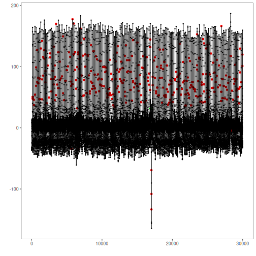

Real data from human medicine, biology, meteorology and industry

* Selection with ECG data series
* Univariate series with labeled anomalies
* Recommended use: univariate anomaly detection

Source: https://paperswithcode.com/dataset/ucr-anomaly-archive


## Load series

``` r
library(dalevents)
library(daltoolbox)
library(harbinger)
```

Selecting a well as example

``` r
## Load series ----------------------
data(ucr_ecg)
```


``` r
#Selecting series
series <- ucr_ecg[[3]]
plot(as.ts(series$value))
```


## Event detection experiment

Detection steps

``` r
#Establishing arima method
model <- hanr_arima()
```


``` r
#Fitting the model
model <- fit(model, series$value)
```


``` r
#Making detections
detection <- detect(model, series$value)
```


## Results analysis


``` r
#Filtering detected events
print(detection |> dplyr::filter(event==TRUE))
```

```
##       idx event    type
## 1     121  TRUE anomaly
## 2     128  TRUE anomaly
## 3     288  TRUE anomaly
## 4     295  TRUE anomaly
## 5     462  TRUE anomaly
## 6     621  TRUE anomaly
## 7     627  TRUE anomaly
## 8     790  TRUE anomaly
## 9     794  TRUE anomaly
## 10    955  TRUE anomaly
## 11    961  TRUE anomaly
## 12   1122  TRUE anomaly
## 13   1129  TRUE anomaly
## 14   1295  TRUE anomaly
## 15   1455  TRUE anomaly
## 16   1458  TRUE anomaly
## 17   1462  TRUE anomaly
## 18   1623  TRUE anomaly
## 19   1628  TRUE anomaly
## 20   1790  TRUE anomaly
## 21   1794  TRUE anomaly
## 22   1953  TRUE anomaly
## 23   1959  TRUE anomaly
## 24   2127  TRUE anomaly
## 25   2295  TRUE anomaly
## 26   2464  TRUE anomaly
## 27   2622  TRUE anomaly
## 28   2626  TRUE anomaly
## 29   2788  TRUE anomaly
## 30   2794  TRUE anomaly
## 31   2961  TRUE anomaly
## 32   3122  TRUE anomaly
## 33   3124  TRUE anomaly
## 34   3128  TRUE anomaly
## 35   3289  TRUE anomaly
## 36   3291  TRUE anomaly
## 37   3296  TRUE anomaly
## 38   3458  TRUE anomaly
## 39   3463  TRUE anomaly
## 40   3634  TRUE anomaly
## 41   3795  TRUE anomaly
## 42   3801  TRUE anomaly
## 43   3965  TRUE anomaly
## 44   3970  TRUE anomaly
## 45   4139  TRUE anomaly
## 46   4309  TRUE anomaly
## 47   4469  TRUE anomaly
## 48   4473  TRUE anomaly
## 49   4640  TRUE anomaly
## 50   4807  TRUE anomaly
## 51   4975  TRUE anomaly
## 52   5142  TRUE anomaly
## 53   5308  TRUE anomaly
## 54   5475  TRUE anomaly
## 55   5636  TRUE anomaly
## 56   5642  TRUE anomaly
## 57   5677  TRUE anomaly
## 58   5805  TRUE anomaly
## 59   5807  TRUE anomaly
## 60   5970  TRUE anomaly
## 61   5972  TRUE anomaly
## 62   6133  TRUE anomaly
## 63   6138  TRUE anomaly
## 64   6228  TRUE anomaly
## 65   6298  TRUE anomaly
## 66   6304  TRUE anomaly
## 67   6306  TRUE anomaly
## 68   6460  TRUE anomaly
## 69   6467  TRUE anomaly
## 70   6622  TRUE anomaly
## 71   6626  TRUE anomaly
## 72   6629  TRUE anomaly
## 73   6637  TRUE anomaly
## 74   6787  TRUE anomaly
## 75   6792  TRUE anomaly
## 76   6955  TRUE anomaly
## 77   6957  TRUE anomaly
## 78   7120  TRUE anomaly
## 79   7282  TRUE anomaly
## 80   7287  TRUE anomaly
## 81   7447  TRUE anomaly
## 82   7450  TRUE anomaly
## 83   7454  TRUE anomaly
## 84   7616  TRUE anomaly
## 85   7620  TRUE anomaly
## 86   7789  TRUE anomaly
## 87   7950  TRUE anomaly
## 88   7954  TRUE anomaly
## 89   8122  TRUE anomaly
## 90   8280  TRUE anomaly
## 91   8287  TRUE anomaly
## 92   8447  TRUE anomaly
## 93   8449  TRUE anomaly
## 94   8453  TRUE anomaly
## 95   8614  TRUE anomaly
## 96   8620  TRUE anomaly
## 97   8780  TRUE anomaly
## 98   8786  TRUE anomaly
## 99   8947  TRUE anomaly
## 100  8953  TRUE anomaly
## 101  9111  TRUE anomaly
## 102  9113  TRUE anomaly
## 103  9118  TRUE anomaly
## 104  9282  TRUE anomaly
## 105  9444  TRUE anomaly
## 106  9450  TRUE anomaly
## 107  9610  TRUE anomaly
## 108  9616  TRUE anomaly
## 109  9618  TRUE anomaly
## 110  9774  TRUE anomaly
## 111  9780  TRUE anomaly
## 112  9942  TRUE anomaly
## 113  9948  TRUE anomaly
## 114 10115  TRUE anomaly
## 115 10274  TRUE anomaly
## 116 10280  TRUE anomaly
## 117 10441  TRUE anomaly
## 118 10446  TRUE anomaly
## 119 10608  TRUE anomaly
## 120 10613  TRUE anomaly
## 121 10773  TRUE anomaly
## 122 10780  TRUE anomaly
## 123 10938  TRUE anomaly
## 124 10945  TRUE anomaly
## 125 11105  TRUE anomaly
## 126 11107  TRUE anomaly
## 127 11112  TRUE anomaly
## 128 11270  TRUE anomaly
## 129 11277  TRUE anomaly
## 130 11434  TRUE anomaly
## 131 11441  TRUE anomaly
## 132 11599  TRUE anomaly
## 133 11606  TRUE anomaly
## 134 11770  TRUE anomaly
## 135 11925  TRUE anomaly
## 136 11930  TRUE anomaly
## 137 12088  TRUE anomaly
## 138 12090  TRUE anomaly
## 139 12094  TRUE anomaly
## 140 12254  TRUE anomaly
## 141 12258  TRUE anomaly
## 142 12415  TRUE anomaly
## 143 12421  TRUE anomaly
## 144 12579  TRUE anomaly
## 145 12585  TRUE anomaly
## 146 12742  TRUE anomaly
## 147 12748  TRUE anomaly
## 148 12905  TRUE anomaly
## 149 12911  TRUE anomaly
## 150 13075  TRUE anomaly
## 151 13233  TRUE anomaly
## 152 13235  TRUE anomaly
## 153 13240  TRUE anomaly
## 154 13399  TRUE anomaly
## 155 13403  TRUE anomaly
## 156 13558  TRUE anomaly
## 157 13563  TRUE anomaly
## 158 13726  TRUE anomaly
## 159 13892  TRUE anomaly
## 160 14051  TRUE anomaly
## 161 14057  TRUE anomaly
## 162 14216  TRUE anomaly
## 163 14222  TRUE anomaly
## 164 14381  TRUE anomaly
## 165 14383  TRUE anomaly
## 166 14387  TRUE anomaly
## 167 14552  TRUE anomaly
## 168 14715  TRUE anomaly
## 169 14878  TRUE anomaly
## 170 15039  TRUE anomaly
## 171 15043  TRUE anomaly
## 172 15203  TRUE anomaly
## 173 15208  TRUE anomaly
## 174 15361  TRUE anomaly
## 175 15367  TRUE anomaly
## 176 15526  TRUE anomaly
## 177 15533  TRUE anomaly
## 178 15698  TRUE anomaly
## 179 15860  TRUE anomaly
## 180 15864  TRUE anomaly
## 181 16032  TRUE anomaly
## 182 16199  TRUE anomaly
## 183 16366  TRUE anomaly
## 184 16527  TRUE anomaly
## 185 16533  TRUE anomaly
## 186 16693  TRUE anomaly
## 187 16699  TRUE anomaly
## 188 16858  TRUE anomaly
## 189 16861  TRUE anomaly
## 190 16864  TRUE anomaly
## 191 16900  TRUE anomaly
## 192 17023  TRUE anomaly
## 193 17025  TRUE anomaly
## 194 17029  TRUE anomaly
## 195 17191  TRUE anomaly
## 196 17197  TRUE anomaly
## 197 17364  TRUE anomaly
## 198 17528  TRUE anomaly
## 199 17533  TRUE anomaly
## 200 17695  TRUE anomaly
## 201 17702  TRUE anomaly
## 202 17864  TRUE anomaly
## 203 17869  TRUE anomaly
## 204 18036  TRUE anomaly
## 205 18038  TRUE anomaly
## 206 18198  TRUE anomaly
## 207 18202  TRUE anomaly
## 208 18364  TRUE anomaly
## 209 18369  TRUE anomaly
## 210 18532  TRUE anomaly
## 211 18538  TRUE anomaly
## 212 18699  TRUE anomaly
## 213 18701  TRUE anomaly
## 214 18705  TRUE anomaly
## 215 18867  TRUE anomaly
## 216 18873  TRUE anomaly
## 217 19035  TRUE anomaly
## 218 19042  TRUE anomaly
## 219 19200  TRUE anomaly
## 220 19206  TRUE anomaly
## 221 19366  TRUE anomaly
## 222 19373  TRUE anomaly
## 223 19536  TRUE anomaly
## 224 19542  TRUE anomaly
## 225 19703  TRUE anomaly
## 226 19710  TRUE anomaly
## 227 19712  TRUE anomaly
## 228 19871  TRUE anomaly
## 229 19877  TRUE anomaly
## 230 20037  TRUE anomaly
## 231 20044  TRUE anomaly
## 232 20210  TRUE anomaly
## 233 20370  TRUE anomaly
## 234 20376  TRUE anomaly
## 235 20542  TRUE anomaly
## 236 20702  TRUE anomaly
## 237 20708  TRUE anomaly
## 238 20870  TRUE anomaly
## 239 20876  TRUE anomaly
## 240 21037  TRUE anomaly
## 241 21039  TRUE anomaly
## 242 21043  TRUE anomaly
## 243 21203  TRUE anomaly
## 244 21210  TRUE anomaly
## 245 21377  TRUE anomaly
## 246 21539  TRUE anomaly
## 247 21545  TRUE anomaly
## 248 21711  TRUE anomaly
## 249 21868  TRUE anomaly
## 250 21875  TRUE anomaly
## 251 22035  TRUE anomaly
## 252 22041  TRUE anomaly
## 253 22202  TRUE anomaly
## 254 22208  TRUE anomaly
## 255 22367  TRUE anomaly
## 256 22369  TRUE anomaly
## 257 22374  TRUE anomaly
## 258 22533  TRUE anomaly
## 259 22538  TRUE anomaly
## 260 22697  TRUE anomaly
## 261 22704  TRUE anomaly
## 262 22864  TRUE anomaly
## 263 22870  TRUE anomaly
## 264 23033  TRUE anomaly
## 265 23191  TRUE anomaly
## 266 23197  TRUE anomaly
## 267 23361  TRUE anomaly
## 268 23520  TRUE anomaly
## 269 23522  TRUE anomaly
## 270 23525  TRUE anomaly
## 271 23682  TRUE anomaly
## 272 23689  TRUE anomaly
## 273 23848  TRUE anomaly
## 274 23852  TRUE anomaly
## 275 24009  TRUE anomaly
## 276 24016  TRUE anomaly
## 277 24173  TRUE anomaly
## 278 24179  TRUE anomaly
## 279 24334  TRUE anomaly
## 280 24336  TRUE anomaly
## 281 24340  TRUE anomaly
## 282 24497  TRUE anomaly
## 283 24499  TRUE anomaly
## 284 24503  TRUE anomaly
## 285 24668  TRUE anomaly
## 286 24826  TRUE anomaly
## 287 24830  TRUE anomaly
## 288 24986  TRUE anomaly
## 289 24989  TRUE anomaly
## 290 24993  TRUE anomaly
## 291 25158  TRUE anomaly
## 292 25323  TRUE anomaly
## 293 25488  TRUE anomaly
## 294 25648  TRUE anomaly
## 295 25654  TRUE anomaly
## 296 25813  TRUE anomaly
## 297 25819  TRUE anomaly
## 298 25979  TRUE anomaly
## 299 25985  TRUE anomaly
## 300 26150  TRUE anomaly
## 301 26309  TRUE anomaly
## 302 26314  TRUE anomaly
## 303 26480  TRUE anomaly
## 304 26642  TRUE anomaly
## 305 26807  TRUE anomaly
## 306 26965  TRUE anomaly
## 307 26970  TRUE anomaly
## 308 26972  TRUE anomaly
## 309 27131  TRUE anomaly
## 310 27137  TRUE anomaly
## 311 27296  TRUE anomaly
## 312 27302  TRUE anomaly
## 313 27467  TRUE anomaly
## 314 27625  TRUE anomaly
## 315 27631  TRUE anomaly
## 316 27790  TRUE anomaly
## 317 27797  TRUE anomaly
## 318 27963  TRUE anomaly
## 319 28122  TRUE anomaly
## 320 28128  TRUE anomaly
## 321 28294  TRUE anomaly
## 322 28460  TRUE anomaly
## 323 28462  TRUE anomaly
## 324 28629  TRUE anomaly
## 325 28788  TRUE anomaly
## 326 28794  TRUE anomaly
## 327 28955  TRUE anomaly
## 328 28960  TRUE anomaly
## 329 29122  TRUE anomaly
## 330 29128  TRUE anomaly
## 331 29288  TRUE anomaly
## 332 29295  TRUE anomaly
## 333 29458  TRUE anomaly
##  [ reached 'max' / getOption("max.print") -- omitted 7 rows ]
```

Visual analysis

``` r
#Ploting the results
grf <- har_plot(model, series$value, detection, series$event)
plot(grf)
```



Evaluate metrics

``` r
#Evaluating the detection metrics
ev <- evaluate(model, detection$event, series$event)
print(ev$confMatrix)
```

```
##           event      
## detection TRUE  FALSE
## TRUE      1     339  
## FALSE     0     29660
```

