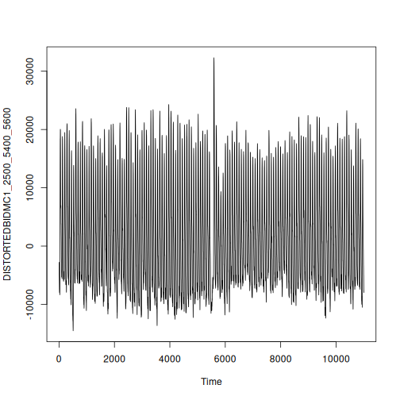
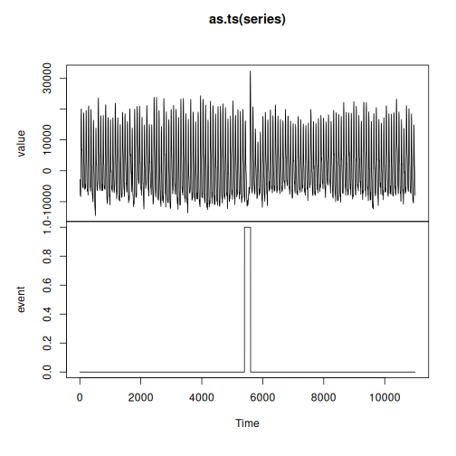
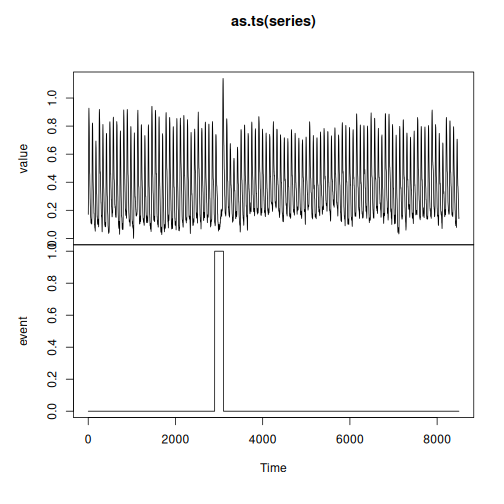
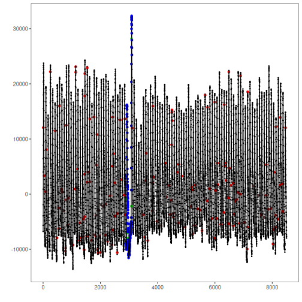

Real data from human medicine, biology, meteorology and industry

* Univariate series with labeled anomalies
* Recommended use: univariate anomaly detection

Source: https://paperswithcode.com/dataset/ucr-anomaly-archive


## Load series

``` r
library(dalevents)
library(daltoolbox)
library(harbinger)


## Load series ----------------------
data(ucr)
```

Selecting a well as example

``` r
#Selecting
series <- ucr$`004_UCR_Anomaly_DISTORTEDBIDMC1_2500_5400_5600.RData`
plot(as.ts(series))
```




## Labels adjust

Understanding the dataset, including the data types and intended use, is essential to ensuring accurate interpretation of the labels. In the UCR Anomaly Archive, the labels identified in the nomenclature of each series identify a range in which at least one point should be found as an anomaly. These labels were developed in collaboration with experts and evaluated for complexity to represent rare events. For event detection purposes, the labels are being adjusted to consider all points in the range as events.

The name of each series in this dataset ends with three numbers separated by "_". Each number indicates a metadata of the series, as described below.

* Example: 004_UCR_Anomaly_DISTORTEDBIDMC1_2500_5400_5600
* First number: 2500 -> Indicates the beginning of the data to be used to test event detection methods
* Second number: 5400 -> Indicates the beginning of the anomalous region
* Third number: 5600 -> Indicates the end of the anomalous region


``` r
#Labels
#IDX = 5400_5600 -> Range defined in dataset documentation
series$event <- 0
series$event[5400:5600] <- 1
names(series) <- c("value", "event")
plot(as.ts(series))
```




UCR Anomaly Archive recommended sample: Observations containing normal data and anomalies


``` r
#Sample
#Test: 2500
start = 2500

series <- series[(start+1):nrow(series),]
plot(as.ts(series))
```


## Preprocessing

* Normalize data


``` r
preproc <- ts_norm_gminmax()
```

```
## Error in ts_norm_gminmax(): could not find function "ts_norm_gminmax"
```

``` r
preproc <- fit(preproc, series$value)
```

```
## Error: object 'preproc' not found
```

``` r
series$value <- transform(preproc, series$value)
```

```
## Error: object 'preproc' not found
```

``` r
head(series)
```

```
## # A tibble: 6 × 2
##    value event
##    <dbl> <dbl>
## 1 -6757.     0
## 2 -5657.     0
## 3 -3928.     0
## 4 -1915.     0
## 5   906.     0
## 6  4012.     0
```

``` r
plot(as.ts(series))
```




## Event detection experiment

Creating a data frame to organize experiment results.


``` r
#Experiments results organization
experiment <- data.frame(method="hanr_arima",
                         dataset="UCR",
                         series="BIDMC1",
                         elapsed_time_fit=0,
                         elapsed_time_detection=0,
                         accuracy=0,
                         precision=0,
                         recall=0,
                         F1=0)

head(experiment)
```

```
##       method dataset series elapsed_time_fit elapsed_time_detection accuracy precision recall F1
## 1 hanr_arima     UCR BIDMC1                0                      0        0         0      0  0
```
Detection steps

``` r
#Establishing arima method
model <- hanr_arima()
```


``` r
#Fitting the model
s <- Sys.time()
model <- fit(model, series$value)
t_fit <- Sys.time()-s
```


``` r
#Making detections
s <- Sys.time()
detection <- detect(model, series$value)
t_det <- Sys.time()-s
```


## Results analysis


``` r
#Filtering detected events
print(detection |> dplyr::filter(event==TRUE))
```

```
##      idx event    type
## 1      9  TRUE anomaly
## 2     36  TRUE anomaly
## 3     87  TRUE anomaly
## 4    108  TRUE anomaly
## 5    253  TRUE anomaly
## 6    425  TRUE anomaly
## 7    483  TRUE anomaly
## 8    559  TRUE anomaly
## 9    563  TRUE anomaly
## 10   570  TRUE anomaly
## 11   645  TRUE anomaly
## 12   677  TRUE anomaly
## 13   726  TRUE anomaly
## 14   779  TRUE anomaly
## 15   788  TRUE anomaly
## 16   804  TRUE anomaly
## 17   808  TRUE anomaly
## 18   856  TRUE anomaly
## 19   884  TRUE anomaly
## 20  1045  TRUE anomaly
## 21  1125  TRUE anomaly
## 22  1138  TRUE anomaly
## 23  1140  TRUE anomaly
## 24  1209  TRUE anomaly
## 25  1269  TRUE anomaly
## 26  1288  TRUE anomaly
## 27  1346  TRUE anomaly
## 28  1405  TRUE anomaly
## 29  1436  TRUE anomaly
## 30  1448  TRUE anomaly
## 31  1450  TRUE anomaly
## 32  1454  TRUE anomaly
## 33  1456  TRUE anomaly
## 34  1525  TRUE anomaly
## 35  1531  TRUE anomaly
## 36  1543  TRUE anomaly
## 37  1565  TRUE anomaly
## 38  1632  TRUE anomaly
## 39  1639  TRUE anomaly
## 40  1693  TRUE anomaly
## 41  1772  TRUE anomaly
## 42  1778  TRUE anomaly
## 43  1845  TRUE anomaly
## 44  1855  TRUE anomaly
## 45  1858  TRUE anomaly
## 46  1878  TRUE anomaly
## 47  1910  TRUE anomaly
## 48  1934  TRUE anomaly
## 49  1939  TRUE anomaly
## 50  1985  TRUE anomaly
## 51  2016  TRUE anomaly
## 52  2021  TRUE anomaly
## 53  2101  TRUE anomaly
## 54  2180  TRUE anomaly
## 55  2182  TRUE anomaly
## 56  2250  TRUE anomaly
## 57  2349  TRUE anomaly
## 58  2403  TRUE anomaly
## 59  2426  TRUE anomaly
## 60  2431  TRUE anomaly
## 61  2435  TRUE anomaly
## 62  2452  TRUE anomaly
## 63  2509  TRUE anomaly
## 64  2511  TRUE anomaly
## 65  2587  TRUE anomaly
## 66  2592  TRUE anomaly
## 67  2693  TRUE anomaly
## 68  2757  TRUE anomaly
## 69  2837  TRUE anomaly
## 70  2858  TRUE anomaly
## 71  2885  TRUE anomaly
## 72  2916  TRUE anomaly
## 73  2919  TRUE anomaly
## 74  2971  TRUE anomaly
## 75  3078  TRUE anomaly
## 76  3087  TRUE anomaly
## 77  3112  TRUE anomaly
## 78  3493  TRUE anomaly
## 79  3552  TRUE anomaly
## 80  3576  TRUE anomaly
## 81  3599  TRUE anomaly
## 82  3655  TRUE anomaly
## 83  3820  TRUE anomaly
## 84  3822  TRUE anomaly
## 85  3829  TRUE anomaly
## 86  3847  TRUE anomaly
## 87  3903  TRUE anomaly
## 88  3982  TRUE anomaly
## 89  4121  TRUE anomaly
## 90  4263  TRUE anomaly
## 91  4315  TRUE anomaly
## 92  4400  TRUE anomaly
## 93  4443  TRUE anomaly
## 94  4483  TRUE anomaly
## 95  4488  TRUE anomaly
## 96  4494  TRUE anomaly
## 97  4498  TRUE anomaly
## 98  4501  TRUE anomaly
## 99  4534  TRUE anomaly
## 100 4542  TRUE anomaly
## 101 4680  TRUE anomaly
## 102 4731  TRUE anomaly
## 103 4736  TRUE anomaly
## 104 4842  TRUE anomaly
## 105 4958  TRUE anomaly
## 106 5150  TRUE anomaly
## 107 5185  TRUE anomaly
## 108 5223  TRUE anomaly
## 109 5234  TRUE anomaly
## 110 5289  TRUE anomaly
## 111 5316  TRUE anomaly
## 112 5397  TRUE anomaly
## 113 5480  TRUE anomaly
## 114 5548  TRUE anomaly
## 115 5658  TRUE anomaly
## 116 5729  TRUE anomaly
## 117 5743  TRUE anomaly
## 118 5814  TRUE anomaly
## 119 5895  TRUE anomaly
## 120 5976  TRUE anomaly
## 121 5995  TRUE anomaly
## 122 6019  TRUE anomaly
## 123 6060  TRUE anomaly
## 124 6085  TRUE anomaly
## 125 6097  TRUE anomaly
## 126 6205  TRUE anomaly
## 127 6309  TRUE anomaly
## 128 6327  TRUE anomaly
## 129 6338  TRUE anomaly
## 130 6341  TRUE anomaly
## 131 6394  TRUE anomaly
## 132 6472  TRUE anomaly
## 133 6474  TRUE anomaly
## 134 6486  TRUE anomaly
## 135 6503  TRUE anomaly
## 136 6557  TRUE anomaly
## 137 6631  TRUE anomaly
## 138 6640  TRUE anomaly
## 139 6691  TRUE anomaly
## 140 6721  TRUE anomaly
## 141 6755  TRUE anomaly
## 142 6802  TRUE anomaly
## 143 6867  TRUE anomaly
## 144 6884  TRUE anomaly
## 145 6894  TRUE anomaly
## 146 7048  TRUE anomaly
## 147 7127  TRUE anomaly
## 148 7130  TRUE anomaly
## 149 7143  TRUE anomaly
## 150 7333  TRUE anomaly
## 151 7542  TRUE anomaly
## 152 7623  TRUE anomaly
## 153 7707  TRUE anomaly
## 154 7791  TRUE anomaly
## 155 7793  TRUE anomaly
## 156 7870  TRUE anomaly
## 157 7953  TRUE anomaly
## 158 8025  TRUE anomaly
## 159 8036  TRUE anomaly
## 160 8063  TRUE anomaly
## 161 8095  TRUE anomaly
## 162 8120  TRUE anomaly
## 163 8135  TRUE anomaly
## 164 8197  TRUE anomaly
## 165 8283  TRUE anomaly
## 166 8287  TRUE anomaly
## 167 8364  TRUE anomaly
## 168 8366  TRUE anomaly
## 169 8464  TRUE anomaly
```

Visual analysis

``` r
#Ploting the results
grf <- har_plot(model, series$value, detection, series$event)
plot(grf)
```



Evaluate metrics

``` r
#Evaluating the detection metrics
ev <- evaluate(model, detection$event, series$event)
print(ev$confMatrix)
```

```
##           event      
## detection TRUE  FALSE
## TRUE      5     164  
## FALSE     196   8135
```

Recording experiment results

``` r
#Experiment update
#Time
experiment$elapsed_time_fit[1] <- as.numeric(t_fit)*60
experiment$elapsed_time_detection[1] <- as.numeric(t_det)*60

#Metrics
experiment$accuracy[1] <- ev$accuracy
experiment$precision[1] <- ev$precision
experiment$recall[1] <- ev$recall
experiment$F1[1] <- ev$F1

print(experiment)
```

```
##       method dataset series elapsed_time_fit elapsed_time_detection  accuracy precision     recall
## 1 hanr_arima     UCR BIDMC1         136.7402               64.30505 0.9576471 0.0295858 0.02487562
##           F1
## 1 0.02702703
```


### SoftEd Evaluation
To analyze the results considering temporal tolerance, softED smoothed metrics can be used, as performed below.


``` r
s=(5400-5600)*-1
ev_soft <- evaluate(har_eval_soft(sw=s), detection$event, as.logical(series$event))
print(ev_soft$confMatrix)
```

```
##           event       
## detection TRUE  FALSE 
## TRUE      8.6   160.4 
## FALSE     192.4 8138.6
```


``` r
print(ev_soft$accuracy)
```

```
## [1] 0.9584929
```

``` r
print(ev_soft$F1)
```

```
## [1] 0.04645946
```

### Add new series to experiment 
Repeat detection steps

* Add new rows to the `experiment` data frame
* Run detection steps (create model, fit and detect) for the new series
* Update `experiment` with the new series result
  * Repeated steps for didactic purposes
  * WARNING: In real experimental situations, variable selection and repetition of detection steps should be encapsulated in a loop or function

### Experiment record
The retain experiments data record results

* Save detection results: Save `detection` object after detection of each series
* Save experiment: Save `experiment` object after finishing the complete experiment
